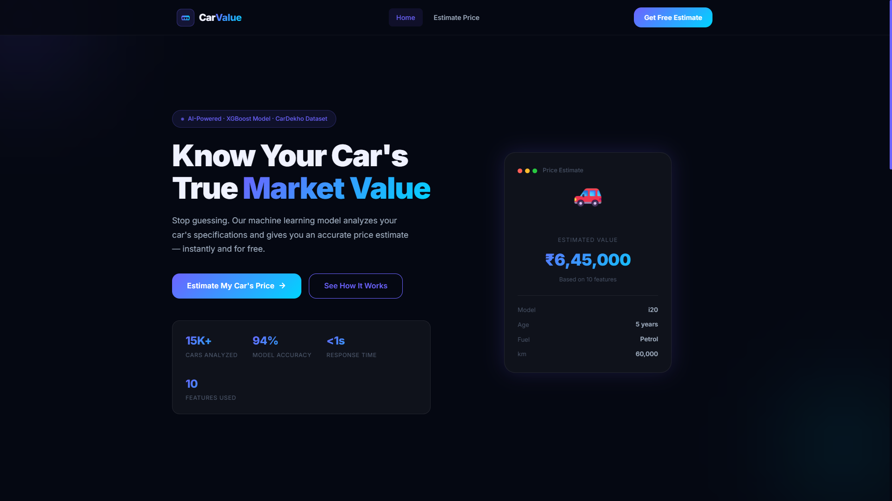
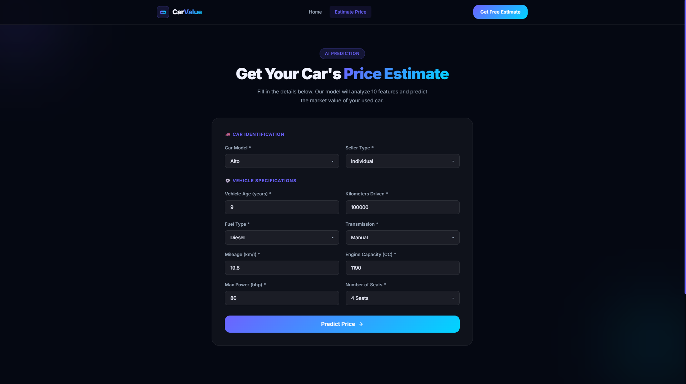
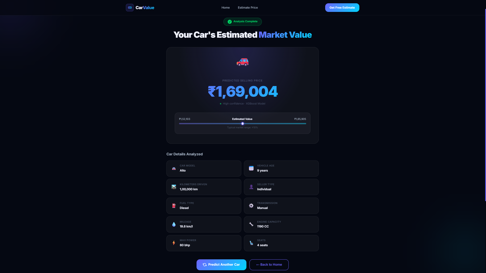

# 🚗 Used Car Price Prediction


A full-stack machine learning web application that predicts the market price of used cars based on 10 key vehicle features. Built with a **React (Vite)** frontend and a **Flask** backend powered by an **Machine Learning**  model - fully deployed on **Render**.

---

## 📋 Table of Contents

1. Project Overview
2. Tech Stack
3. Project Structure
4. Machine Learning Pipeline
   - Dataset
   - Exploratory Data Analysis
   - Data Preprocessing
   - Model Training
   - Model Artifacts
5. Backend - Flask API
   - Setup & Installation
   - Running the Server
6. Frontend - React App
   - Setup & Installation
   - Running the Dev Server
7. How to Run the Full App
8. Input Features Reference
9. Dependencies
10. Deployment
11. Live Demo

## Project Overview

**CarValue** is a full-stack AI application that allows users to get an instant price estimate for a used car by entering its specifications. The prediction is powered by an **XGBoost Regressor** trained on the **CarDekho dataset** (~15,000 listings), achieving high accuracy by analyzing 10 key vehicle features.

---


## 🖥️ Tech Stack

### Frontend
| Technology | Version | Purpose |
|---|---|---|
| React | ^19.2.4 | UI framework |
| React Router DOM | ^7.14.0 | Client-side routing |
| Vite | ^8.0.1 | Build tool & dev server |
| Axios | ^1.14.0 | HTTP client |
| Vanilla CSS | — | Styling |

### Backend
| Technology | Purpose |
|---|---|
| Flask | REST API server |
| Flask-CORS | Cross-origin request handling |
| XGBoost | Price prediction ML model |
| scikit-learn | Preprocessing pipeline |
| pandas | Data manipulation |
| numpy | Numerical operations |
| pickle | Model serialization |

---


## 📁 Project Structure

```
Used Car Price Prediction/
│
├── Frontend/                          # React + Vite frontend
│   ├── public/
│   ├── src/
│   │   ├── api/
│   │   │   └── predict.js             # API call to Flask backend
│   │   ├── components/
│   │   │   ├── Navbar.jsx             # Navigation bar
│   │   │   ├── Navbar.css
│   │   │   ├── Footer.jsx             # Footer
│   │   │   └── Footer.css
│   │   ├── pages/
│   │   │   ├── LandingPage.jsx        # Home / landing page
│   │   │   ├── LandingPage.css
│   │   │   ├── PredictionPage.jsx     # Input form page
│   │   │   ├── PredictionPage.css
│   │   │   ├── ResultPage.jsx         # Prediction result page
│   │   │   └── ResultPage.css
│   │   ├── App.jsx                    # Router setup
│   │   ├── main.jsx
│   │   ├── index.css
│   │   └── App.css
│   ├── index.html
│   ├── vite.config.js
│   └── package.json
│
└── Used Car Price Prediction/         # Flask backend
    ├── app.py                         # Flask API server
    ├── requirements.txt               # Python dependencies
    ├── .env.example                   # Environment variable template
    ├── models/
    │   ├── Xgboost_Regressor_model.pkl   # Trained XGBoost model
    │   ├── preprocessor.pkl              # Feature preprocessor
    │   └── LabelEncoder.pkl              # Label encoder for car model
    ├── utils/
    │   └── utils.py                   # Prediction helper function
    ├── notebooks/                     # Jupyter notebooks (EDA & training)
    └── data/                          # Dataset files
```

---

<!-- ## ✨ Features

- 🤖 **AI-Powered Predictions** — XGBoost regression model trained on real used car data
- 📋 **10-Feature Input Form** — Captures all key variables that influence car price
- ✅ **Client-side Validation** — Real-time form validation with user-friendly error messages
- 📱 **Responsive Design** — Works seamlessly on desktop and mobile
- ⚡ **Fast & Modern UI** — Built with React 19 and Vite 8 for lightning-fast performance
- 🌐 **Fully Deployed** — Both frontend and backend hosted on Render

--- -->

## Machine Learning Pipeline

| Layer | Technology |
|---|---|
| **ML Model** | XGBoost Regressor |
| **Data Processing** | Pandas, NumPy, Scikit-learn |
| **Visualization** | Matplotlib, Seaborn, Plotly |
| **Backend** | Python 3, Flask, Flask-CORS |
| **Frontend** | React 18, Vite, React Router DOM |
| **Styling** | Vanilla CSS (Dark theme + Glassmorphism) |
| **Fonts** | Google Fonts — Inter |

---

## Dataset

- **Source**: CarDekho dataset (`cardekho_imputated.csv`)
- **Size**: 15,411 rows × 13 columns (after cleaning)
- **Target Variable**: `selling_price` (in Indian Rupees ₹)

**Sample Data:**

| car_name | model | vehicle_age | km_driven | fuel_type | transmission | mileage | engine | max_power | seats | selling_price |
|---|---|---|---|---|---|---|---|---|---|---|
| Maruti Alto | Alto | 9 | 120,000 | Petrol | Manual | 19.70 | 796 | 46.30 | 5 | ₹1,20,000 |
| Hyundai i20 | i20 | 11 | 60,000 | Petrol | Manual | 17.00 | 1,197 | 80.00 | 5 | ₹2,15,000 |
| Ford Ecosport | Ecosport | 6 | 30,000 | Diesel | Manual | 22.77 | 1,498 | 98.59 | 5 | ₹5,70,000 |
| Honda City | City | 2 | 13,000 | Petrol | Automatic | 18.00 | 1,497 | 117.60 | 5 | ₹12,00,000 |

### Exploratory Data Analysis

Performed in `notebooks/used_car_prediction.ipynb`:

- **Missing Values**: Dataset was already imputed — 0 nulls across all columns.
- **Duplicates**: Identified and handled 167 duplicate rows.
- **Feature Inspection**: Examined all 13 columns; dropped `car_name` and `brand` as `model` already captures car identity.
- **Distributions**: Analyzed selling price distribution, mileage vs price, engine vs price correlations.
- **Categorical Inspection**: `seller_type` (Individual, Dealer, Trustmark Dealer), `fuel_type` (Petrol, Diesel, CNG, LPG, Electric), `transmission_type` (Manual, Automatic).

### Data Preprocessing

The preprocessing pipeline (saved as `preprocessor.pkl`) handles:

1. **Label Encoding** — `model` column encoded with `LabelEncoder` (saved as `LabelEncoder.pkl`)
2. **Categorical Encoding** — `seller_type`, `fuel_type`, `transmission_type` one-hot or ordinal encoded via `ColumnTransformer`
3. **Numerical Features** — `vehicle_age`, `km_driven`, `mileage`, `engine`, `max_power`, `seats` passed through the pipeline

**Features used for training (10 total):**

| Feature | Type | Description |
|---|---|---|
| `model` | Categorical | Car model name (e.g., i20, Swift) |
| `vehicle_age` | Numerical | Age of vehicle in years |
| `km_driven` | Numerical | Total kilometers driven |
| `seller_type` | Categorical | Individual / Dealer / Trustmark Dealer |
| `fuel_type` | Categorical | Petrol / Diesel / CNG / LPG / Electric |
| `transmission_type` | Categorical | Manual / Automatic |
| `mileage` | Numerical | Fuel efficiency in km/l |
| `engine` | Numerical | Engine displacement in CC |
| `max_power` | Numerical | Maximum power output in bhp |
| `seats` | Numerical | Number of seats |

### Model Training

- **Algorithm**: XGBoost Regressor (`xgboost` library)
- **Split**: Train/test split applied on the 15K+ dataset
- **Pipeline**: Preprocessing → Label Encoding → XGBoost Prediction
- **Target**: `selling_price` (continuous, in ₹)

### Model Artifacts

All trained artifacts are stored in `Used Car Prediction/models/`:

| File | Description |
|---|---|
| `Xgboost_Regressor_model.pkl` | Trained XGBoost model (~730 KB) |
| `preprocessor.pkl` | Scikit-learn ColumnTransformer pipeline |
| `LabelEncoder.pkl` | LabelEncoder fitted on car model names |

---

---


## 🛠️ Local Development Setup

### Prerequisites
- Node.js ≥ 18
- Python ≥ 3.9
- pip

### 1. Clone the Repository
```bash
git clone https://github.com/NagothuSuryaTeja/Used-Car-Price-Prediction.git

cd Used-Car-Price-Prediction
```

### 2. Backend Setup
```bash
cd "Used Car Price Prediction"

# Create and activate virtual environment

python -m venv venv

venv\Scripts\activate        # Windows

source venv/bin/activate   # macOS/Linux

# Install dependencies
pip install -r requirements.txt

# Set up environment variables
copy .env.example .env       # Windows
# cp .env.example .env       # macOS/Linux

# Run the Flask server
python app.py
```
Backend will be available at: `http://localhost:5000`

### 3. Frontend Setup
```bash
cd Frontend

# Install dependencies
npm install

# Update API base URL for local dev (in src/api/predict.js)
# Uncomment: const API_BASE_URL = 'http://localhost:5000';
# Comment out the production URL

# Run the dev server
npm run dev
```
Frontend will be available at: `http://localhost:5173`

---

### Input Features

| Feature | Type | Description |
|---|---|---|
| `model` | Categorical | Car model name (e.g., Swift, Creta, Nexon) |
| `vehicle_age` | Integer | Age of the vehicle in years |
| `km_driven` | Integer | Total kilometers driven |
| `seller_type` | Categorical | Individual / Dealer / Trustmark Dealer |
| `fuel_type` | Categorical | Petrol / Diesel / CNG / LPG / Electric |
| `transmission_type` | Categorical | Manual / Automatic |
| `mileage` | Float | Fuel efficiency in km/l |
| `engine` | Integer | Engine displacement in CC |
| `max_power` | Float | Maximum power output in bhp |
| `seats` | Integer | Number of seating capacity |


## 📦 Dependencies

### Backend (`requirements.txt`)
```
ipykernel
pandas
numpy
scikit-learn
matplotlib
seaborn
plotly
xgboost
flask
flask-cors
```

### Frontend (`package.json`)
```json
{
  "dependencies": {
    "axios": "^1.14.0",
    "react": "^19.2.4",
    "react-dom": "^19.2.4",
    "react-router-dom": "^7.14.0"
  }
}
```

---

## ☁️ Deployment (Render)

Both services are deployed on [Render](https://render.com).

## 🌐 Live Demo

| Service  | URL |
|----------|-----|
| **Frontend** | [https://used-car-price-prediction-frontend.onrender.com/](https://used-car-price-prediction-frontend.onrender.com/) |
| **Backend API** | [https://used-car-price-prediction-j0je.onrender.com/](https://used-car-price-prediction-j0je.onrender.com/) |

---

<h1 style="text-align:center">Project images</h1>

# Landing Page

<a href="./Frontend/src/assets/Landingpage.png"><center></center></a>

# Prediction Page
<a href="./Frontend/src/assets/prediction.png"><center></center><a>

# Result Page
<a href="./Frontend/src/assets/result.png"><center></center><a>


## 👤 Author

**Nagothu Surya Teja**
- GitHub: [NagothuSuryaTeja](https://github.com/NagothuSuryaTeja)

---

## 📄 License

This project is open source and available under the [MIT License](LICENSE).
